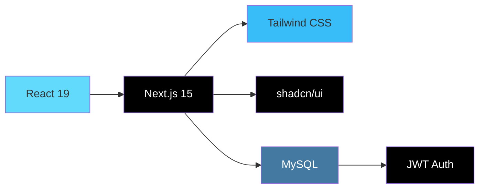

<div align="center">

# 🌐 Website Curator


一个现代化的网站收藏和管理平台，基于 Next.js 和 MySQL 构建。

[](https://choosealicense.com/licenses/mit/) [](https://nextjs.org/) [](https://reactjs.org/) [](https://mysql.com/) [](https://tailwindcss.com/)

</div>

---

## ✨ 功能特性

- 🔐 **用户认证系统** - 基于 JWT 的完整用户管理
- 📝 **网站提交与审核** - 用户可提交网站，管理员审核发布
- 🏷️ **分类和标签管理** - 灵活的网站分类和标签系统
- ⭐ **收藏功能** - 用户可收藏喜欢的网站
- 🎨 **主题切换** - 支持明暗主题切换
- 📱 **响应式设计** - 完美适配各种设备
- 🔍 **搜索功能** - 快速搜索网站内容
- 👥 **用户管理** - 完整的用户权限管理系统
- ⚙️ **系统设置** - 灵活的系统配置管理

## 📸 系统预览

<div align="center">

### 🏠 主页界面
*网站浏览、搜索和分类筛选*


<details>
<summary>🌙 查看深色主题</summary>
<br>

</details>

---

### 📱 响应式设计
*完美适配移动设备*


---

### 🔧 管理后台
*强大的后台管理功能*


---

### ⭐ 用户功能
*个人收藏和网站提交*


*网站提交*


</div>

## 📋 主要功能

<div align="center">

| 功能模块       | 描述                     | 用户角色   |
| -------------- | ------------------------ | ---------- |
| 🏠 **主页浏览** | 网站展示、搜索、分类筛选 | 所有用户   |
| ⭐ **收藏管理** | 个人网站收藏和管理       | 注册用户   |
| 📝 **网站提交** | 提交新网站等待审核       | 注册用户   |
| 🔧 **网站管理** | 审核、编辑、删除网站     | 管理员     |
| 🏷️ **分类管理** | 管理网站分类和标签       | 管理员     |
| 👥 **用户管理** | 用户权限和状态管理       | 超级管理员 |
| ⚙️ **系统设置** | 全局系统配置管理         | 超级管理员 |

</div>

## 🛠️ 技术栈

- **前端框架**: Next.js 15 + React 19
- **样式**: Tailwind CSS + shadcn/ui
- **数据库**: MySQL
- **认证**: JWT + bcrypt
- **状态管理**: React Query (TanStack Query)
- **表单处理**: React Hook Form + Zod
- **测试**: Playwright
- **包管理**: pnpm

## 🏗️ 系统架构

<div align="center">

**[📋 查看详细架构文档](docs/ARCHITECTURE.md)**

</div>

### 技术栈概览



## 🚀 快速开始

### 环境要求

- Node.js 18+
- pnpm
- MySQL 5.7+

### 1. 克隆项目

```bash
git clone https://github.com/Sube3494/website-curator.git
cd website-curator
```

### 2. 安装依赖

```bash
pnpm install
```

### 3. 环境配置

创建 `.env.local` 文件：

```env
# MySQL 数据库配置
DB_HOST=localhost
DB_USER=your_mysql_username
DB_PASSWORD=your_mysql_password
DB_NAME=website_curator

# JWT 密钥
JWT_SECRET=your_jwt_secret_key_here
```

### 4. 数据库设置

1. 安装并启动 MySQL 5.7+
2. 创建数据库：`CREATE DATABASE website_curator;`
3. 运行 `database-init-mysql.sql` 脚本初始化数据库结构
   - 这个脚本包含了完整的数据库结构、初始数据和索引
   - 脚本是幂等的，可以安全地重复运行

### 5. 启动开发服务器

```bash
pnpm dev
```

访问 [http://localhost:3000](http://localhost:3000) 查看应用。

## 📁 项目结构

```
├── app/                    # Next.js App Router
├── components/             # React 组件
│   ├── admin/             # 管理员组件
│   ├── auth/              # 认证组件
│   ├── browse/            # 浏览页面组件
│   ├── favorites/         # 收藏页面组件
│   ├── layout/            # 布局组件
│   ├── settings/          # 设置组件
│   └── ui/                # UI 基础组件
├── hooks/                 # 自定义 Hooks
├── lib/                   # 工具库和配置
├── public/                # 静态资源
├── tests/                 # 测试文件
└── database-init-mysql.sql # MySQL 数据库初始化脚本
```

## 🔧 开发指南

### 数据库架构

主要数据表：
- `users` - 用户信息
- `categories` - 网站分类
- `websites` - 网站数据
- `tags` - 标签
- `favorites` - 用户收藏
- `system_settings` - 系统设置

### 权限系统

- `user` - 普通用户
- `admin` - 管理员
- `super_admin` - 超级管理员

## 🧪 测试

```bash
# 运行所有测试
pnpm test

# 运行测试并显示 UI
pnpm test:ui

# 运行测试（有头模式）
pnpm test:headed
```

## 📦 部署

详细的部署指南请查看：[Vercel 部署指南](docs/vercel-deployment.md)

快速部署步骤：
1. 运行 `pnpm run setup:vercel` 生成环境变量配置
2. 连接 GitHub 仓库到 Vercel
3. 配置环境变量
4. 部署

## 🤝 贡献指南

1. Fork 项目
2. 创建功能分支 (`git checkout -b feature/AmazingFeature`)
3. 提交更改 (`git commit -m 'Add some AmazingFeature'`)
4. 推送到分支 (`git push origin feature/AmazingFeature`)
5. 开启 Pull Request

## 📄 许可证

本项目采用 MIT 许可证 - 查看 [LICENSE](LICENSE) 文件了解详情。

## 👨‍💻 作者

**Sube** - [GitHub](https://github.com/Sube3494)


## 📚 文档

- 📖 [Vercel 部署指南](docs/vercel-deployment.md) - 详细的部署说明
- 🏗️ [架构文档](docs/ARCHITECTURE.md) - 系统架构和技术栈
- ⚖️ [许可证](LICENSE) - MIT 许可证

## 🙏 致谢

- [Next.js](https://nextjs.org/)
- [MySQL](https://mysql.com/)
- [Tailwind CSS](https://tailwindcss.com/)
- [shadcn/ui](https://ui.shadcn.com/)


---

<div align="center">

如果这个项目对您有帮助，请给个 ⭐️！

**[⬆ 回到顶部](#-website-curator)**

</div>
