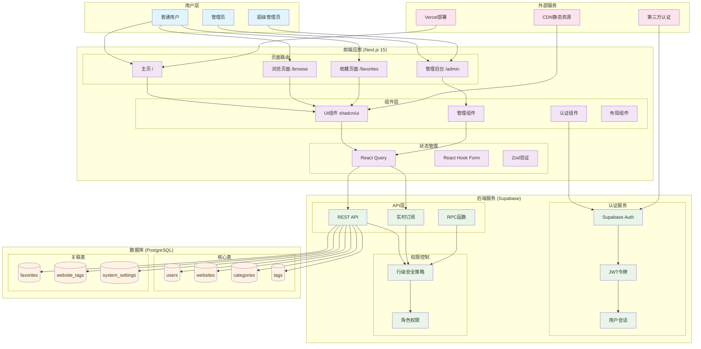
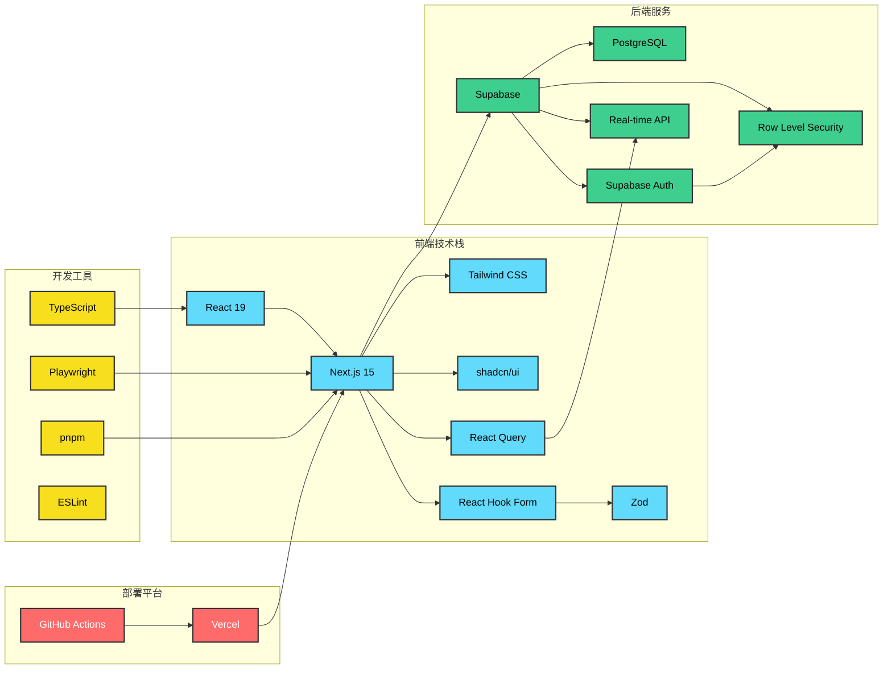
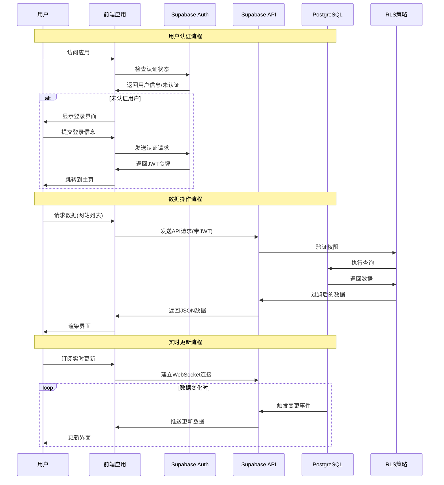

# Website Curator 系统架构文档

## 系统架构概览

Website Curator 是一个基于现代 Web 技术栈构建的网站收藏和管理平台。

### 整体架构

### 技术栈架构

### 数据流架构

## 核心组件说明

### 前端层
- **Next.js 15**: 提供 SSR/SSG 和路由功能
- **React 19**: 用户界面构建
- **Tailwind CSS**: 样式框架
- **shadcn/ui**: UI 组件库
- **React Query**: 数据获取和缓存
- **React Hook Form + Zod**: 表单处理和验证

### 后端层
- **Supabase**: 提供数据库、认证、实时API
- **PostgreSQL**: 关系型数据库
- **Row Level Security**: 数据安全策略
- **JWT**: 用户认证令牌

### 部署层
- **Vercel**: 前端应用部署
- **GitHub Actions**: CI/CD 流水线
- **CDN**: 静态资源分发

## 安全架构

### 认证与授权
1. **JWT 令牌认证**: 基于 Supabase Auth
2. **角色权限控制**: user/admin/super_admin
3. **行级安全策略**: 数据库层面的权限控制

### 数据安全
1. **HTTPS 传输**: 所有数据传输加密
2. **环境变量**: 敏感信息环境隔离
3. **输入验证**: Zod 模式验证
4. **SQL 注入防护**: Supabase 内置防护

## 性能优化

### 前端优化
1. **代码分割**: Next.js 自动代码分割
2. **图片优化**: Next.js Image 组件
3. **缓存策略**: React Query 智能缓存
4. **懒加载**: 组件和路由懒加载

### 后端优化
1. **数据库索引**: 关键字段索引优化
2. **查询优化**: 减少 N+1 查询
3. **实时订阅**: 减少轮询请求
4. **CDN 缓存**: 静态资源缓存

## 扩展性设计

### 水平扩展
- Supabase 自动扩展数据库
- Vercel 自动扩展前端服务
- CDN 全球分发

### 功能扩展
- 模块化组件设计
- 插件化架构预留
- API 版本控制
- 微服务架构准备
